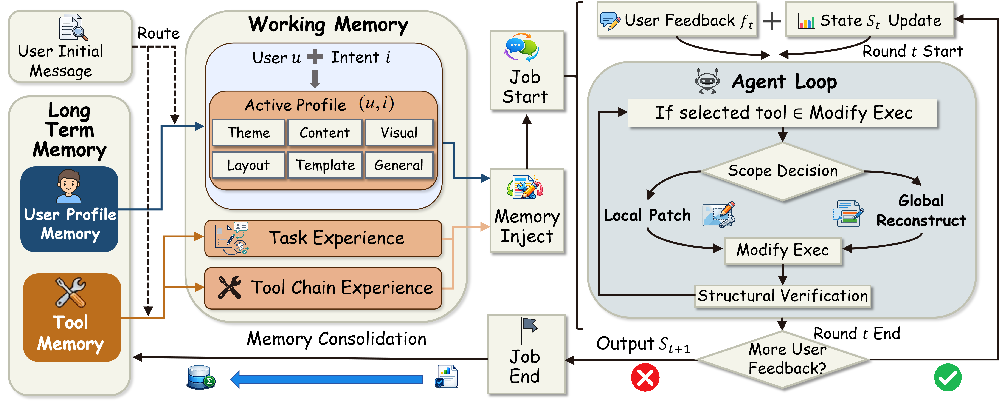
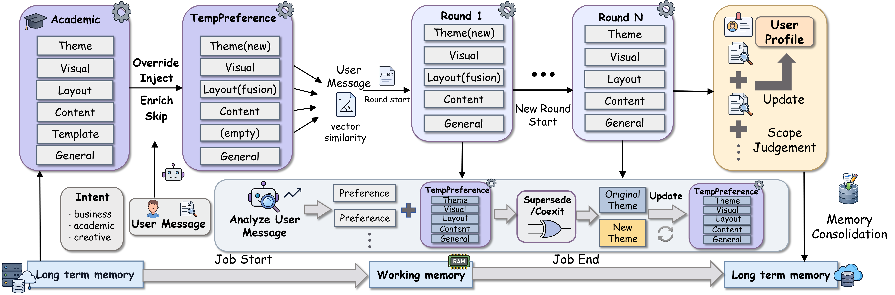
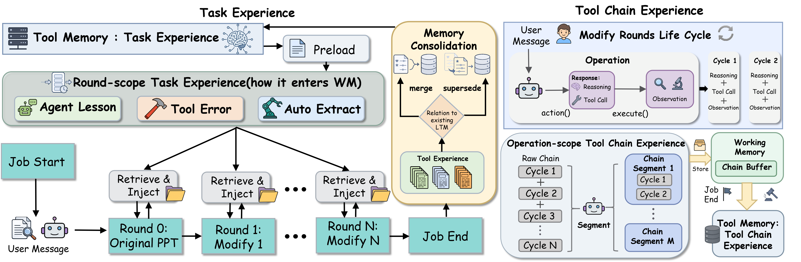
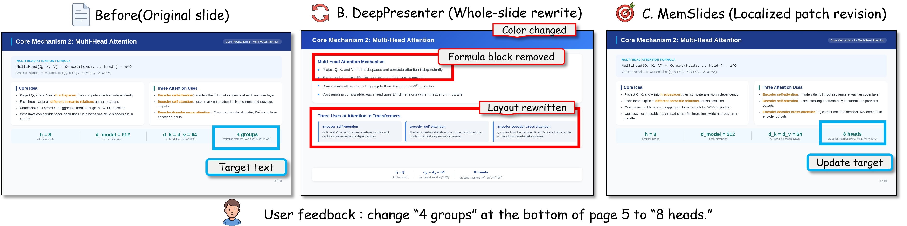

<h1 align="center">
  MemSlides: A Hierarchical Memory-Driven Agent Framework for Personalized Slide Generation with Multi-turn Local Revision
</h1>

<p align="center">
  <strong>Personalized presentation agents with user profile memory, working memory, tool memory, and scoped slide-local revision.</strong>
</p>

<p align="center">
  <a href="https://arxiv.org/abs/2606.17162"></a>
  <a href="https://memslides.github.io/"></a>
  <a href="#demo-video"></a>
  <a href="https://hub.docker.com/r/huohua325/memslides"></a>
  <a href="https://memslides.com/"></a>
</p>

<p align="center">
  
  
  
</p>

<p align="center">
  &#11088; <strong>If MemSlides is useful for your research or slide-generation workflow, please consider starring this repository to help others discover it.</strong>
</p>

## News

<!-- NEWS:START -->
<!-- Add new milestones as the first table row. Keep dates in YYYY-MM-DD format. -->
<table>
  <tr>
    <td width="150" align="center">
      <strong>2026-06-24</strong><br>
      <sub>Community milestone</sub>
    </td>
    <td>
      <strong>&#127942; MemSlides reached #1 Paper of the Day on Hugging Face Daily Papers.</strong><br>
      Thank you for the early attention from the research community. See the
      <a href="https://huggingface.co/papers/2606.17162">#1 Paper of the day</a>,
      <a href="https://huggingface.co/spaces/huohua325/MemSlides">showcase Space</a>,
      and <a href="https://memslides.com/">live demo website</a>.
    </td>
  </tr>
  <tr>
    <td width="150" align="center">
      <strong>2026-06-23</strong><br>
      <sub>Community creation</sub>
    </td>
    <td>
      <strong>&#127911; A MemSlides community member created a ResearchPod episode about our paper.</strong><br>
      <a href="https://researchpod.app/episode/afdb2aa6-91fc-4fbb-abf4-ce2fcf22d6ae">Listen on ResearchPod</a>.
    </td>
  </tr>
</table>
<!-- NEWS:END -->

## Demo Video

https://github.com/user-attachments/assets/a92ab49e-bc5c-4e90-8c0a-0f23b08a8857

## Overview

MemSlides treats presentation generation as a stateful authoring process rather
than a one-shot source-to-slides conversion task. It separates personalization
signals by lifetime: persistent user profile memory captures recurring
cross-job preferences, working memory carries active session constraints across
revision rounds, and tool memory stores reusable execution experience for
reliable localized editing.

Long-term memory stores intent-conditioned user profile memory for round-0
personalization and tool memory for reusable execution experience. Working
memory maintains active preferences, session state, and revision constraints
within the current deck. During revision, MemSlides projects user feedback onto
the smallest affected slide region and applies scoped local patches instead of
repeatedly regenerating the full deck.

<p align="center">
  
</p>

## Highlights

- **Intent-conditioned user profile memory** routes personalization by
  presentation intent, then applies preferences over theme, visual style,
  layout, template use, content strategy, and general presentation habits.
- **Multi-turn working memory** preserves temporary preferences, session
  constraints, and edit-state records across feedback turns in the same deck.
- **Tool memory** retrieves prior task and tool-chain experience before similar
  edit operations to reduce repeated execution failures.
- **Scoped slide-local revision** updates the smallest affected slide region
  instead of repeatedly rewriting the full deck.

## Evidence

<p align="center">
  
  
</p>

<p align="center">
  
</p>

- User profile memory supports persona-aware round-0 personalization by routing
  intent-matched preferences into the current job.
- Working memory carries active session constraints and temporary preferences
  across multi-turn revision.
- Tool memory stores reusable execution experience so future localized edits
  can avoid repeated failures.
- Scoped local revision keeps the edit surface close to the requested element,
  reducing unintended drift in already aligned slide content.

## Quick Start

Install from source:

```bash
sudo apt-get update
sudo apt-get install -y libreoffice fontconfig fonts-noto-cjk poppler-utils

conda env create -f environment.yml
conda activate memslides
pip install -e ".[research]"

python -m playwright install chromium ffmpeg
python -m memslides.experiment --help
```

Run the built-in smoke suite:

```bash
python -m memslides.experiment run smoke_minimal \
  --output-base .memslides/experiments \
  --parallel 1
```

The same experiment can run inside the Docker environment:

```bash
docker compose build
docker compose run --rm memslides python -m memslides.experiment run smoke_minimal \
  --output-base /app/.cache/memslides/experiments \
  --parallel 1
```

`smoke_minimal` is only a small verification suite. Users can pass any local
suite YAML path or packaged suite name to `python -m memslides.experiment run`.

## Configuration

MemSlides needs user-provided model and service credentials for real generation
experiments. Keep credentials outside git and provide them through environment
variables, `.env`, or a private YAML file selected with `MEMSLIDES_CONFIG_FILE`
or `--config`.

The packaged public config is `src/memslides/memslides.yaml`; its placeholders
are expanded from the current process environment when the YAML is loaded.
Generated outputs, caches, private YAML files, and credentials must not be
committed.

For Docker runs with a private YAML file:

```bash
docker compose -f docker-compose.yml -f docker-compose.private.yml run --rm memslides \
  python -m memslides.experiment run smoke_minimal \
  --output-base /app/.cache/memslides/experiments \
  --parallel 1
```

The override maps `./memslides.private.yaml` to
`/run/secrets/memslides.private.yaml` and sets
`MEMSLIDES_CONFIG_FILE=/run/secrets/memslides.private.yaml` inside the
container.

## Experiment CLI

The suite runner is the main public entry point:

```bash
python -m memslides.experiment run smoke_minimal --output-base .memslides/experiments --parallel 1
python -m memslides.experiment report .memslides/experiments/smoke_minimal
python -m memslides.experiment personas
```

Core generation, revision, and template induction commands remain available for
scripted local use:

```bash
python -m memslides generate --instruction "Create a one-slide project summary" --num-pages 1
python -m memslides revise --workspace .memslides/session --feedback "Tighten the title"
python -m memslides template induct --template-file template.pptx
```

## Security And Privacy

- Keep API keys in environment variables, `.env`, or private YAML files.
- Do not commit `.env`, `.memslides/`, generated workspaces, or private config
  files.
- Network acquisition is optional and depends on user-provided search or model
  credentials.
- External URLs and downloaded assets should be reviewed before presenting.

## License

See [LICENSE](LICENSE) and [THIRD_PARTY_NOTICES.md](THIRD_PARTY_NOTICES.md).
